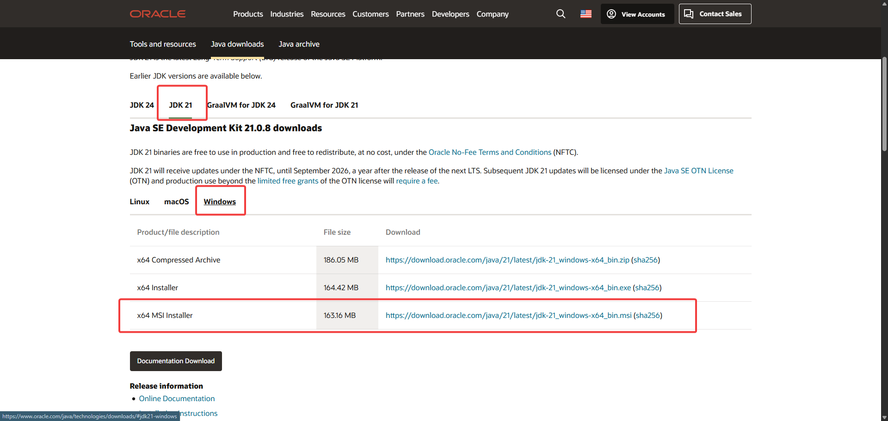
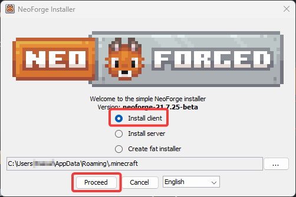
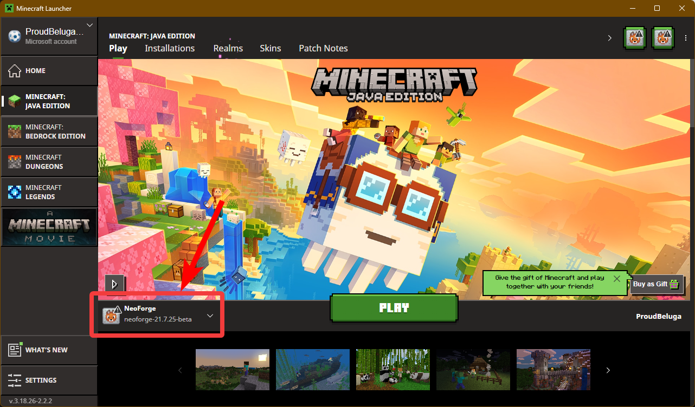

# Minecraft Setup Guide for NeoForge with mods

Follow these steps to install and configure Minecraft with the NeoForge launcher on Windows.

---

## 1. Download and Install Minecraft Laucnher
👉 [Download Minecraft](https://www.minecraft.net/en-us/download)

Once the installation is completed, you need to run the laucher at least once before continuing

---

## 2. Download and Install Java (JDK 21)
You can just click next at every steps to install it in the default directory

👉 [Download Java JDK 21](https://www.oracle.com/java/technologies/downloads/#java21)

---

## 3. Download and Install NeoForge Launcher
👉 [Download NeoForge](https://neoforged.net/)

- a) Select the versions:
  - i) **Minecraft**: 1.21.7
  - ii) **Neoforge**: 21.7.25-beta
  - iii) Click on "Click here to download installer"
- b) Run the installer (you need Java from step 2 for this)
  - i) follow the instructions on the image

---

## 4. Download mods folder

<!-- 👉 [Download Mods](./mods.zip) -->

You should see the Noeforge launcher on the main page (See image)

 