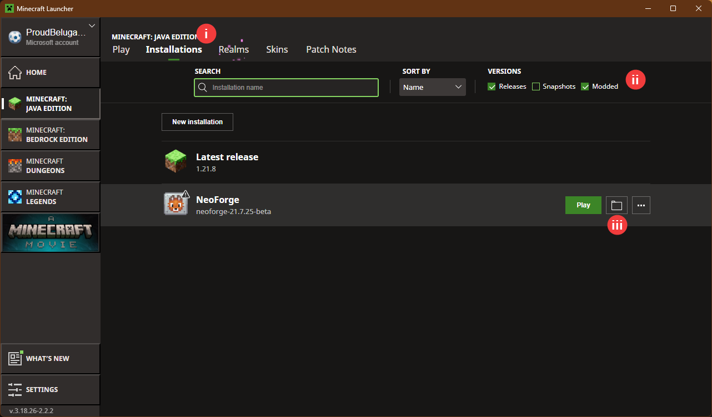
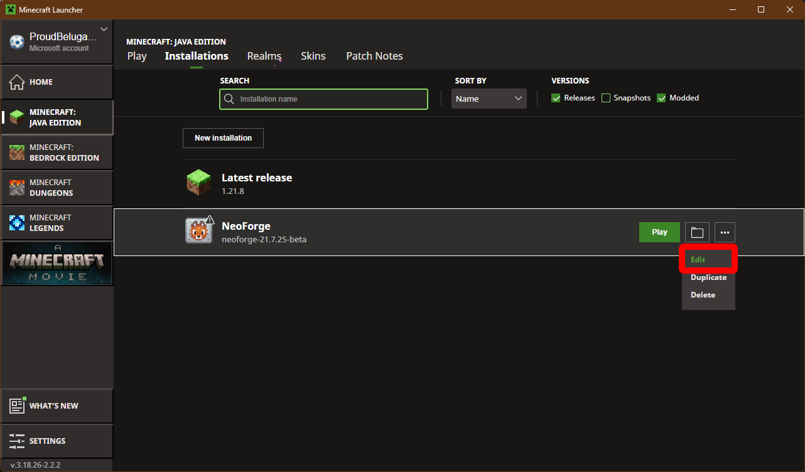
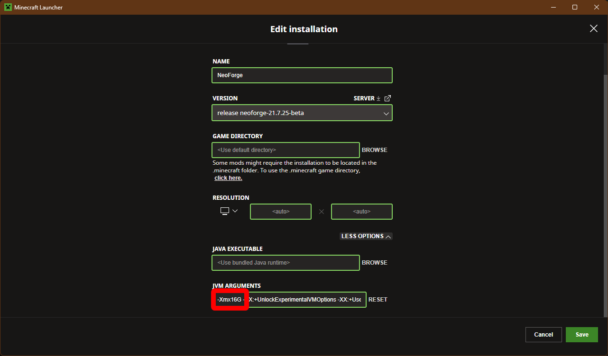
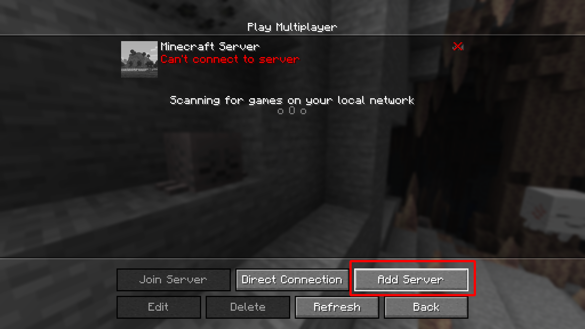

# Minecraft Setup Guide for NeoForge with Mods

## 👉 [Join the Discord](https://discord.gg/6X5sNzka) to chat with other players

---

Follow these steps to install and configure Minecraft with the NeoForge launcher on Windows.

## 1. Download and Install Minecraft Launcher
👉 [Download Minecraft](https://www.minecraft.net/en-us/download)

After installation, **run the launcher at least once** before continuing.

---

## 2. Download and Install Java (JDK 21)
You can accept all default options during installation.  

👉 [Download Java JDK 21](https://www.oracle.com/java/technologies/downloads/#java21)

---

## 3. Download and Install NeoForge Launcher
👉 [Download NeoForge](https://neoforged.net/)

1. **Select the versions:**
   - **Minecraft**: 1.21.11  
   - **NeoForge**: 21.7.27-beta  
   - Click **"Click here to download installer"**
2. **Run the installer** (Java from step 2 is required)  
   - Follow the instructions as shown in the image:

---

## 4. Download Mods Folder

👉 [Download Mods.zip](https://github.com/BerubePascal/Minecraft/releases/tag/V1.21.11)

---

## 5. Install the Mods
1. **Launch Minecraft**  
   You should see the NeoForge launcher on the main page:  
   

2. **Open the Installations menu** and follow the instructions:  
   

3. **Paste the `mods` folder** into the Minecraft directory.  
   - If the folder already exists, overwrite it.

---

## 6. [Optional] Allocate More RAM
Modded Minecraft usually requires more RAM than the default allocation.

1. In the Installations menu, click **Edit**:  
   

2. Click **More options**.  
3. In **JVM Arguments**, adjust the `-XmxYYG-` value, where `YY` is the RAM in GB (example below sets it to 16 GB):  
   
4. **Save** your changes

---

## 7. Run Minecraft
On the main screen click **PLAY**

---

## 8. Connect to server
1. Go to **Multiplayer**

      

2. **Add Server**

      

3. Please contact the Admin for IP adresse

---

## Troubleshooting
If you encounter issues when launching the game please repport it to the Admin. There is a lot of mods installed and the chance of imcompatibility is fairly high.
